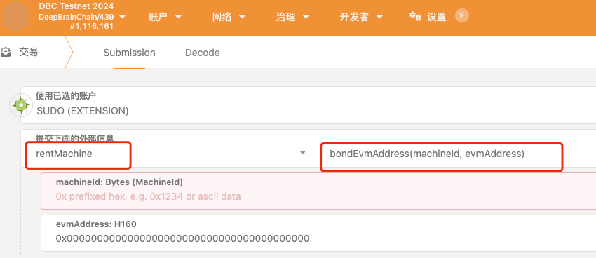

### Minter staking
1. rent a machine which owner by yourself on DBC
2. bond evm address to a machine with owner substrate address on DBC
3. call stake(..) method to stake your machine on staking contract

### Minter claim rewards
1. call claim(..) method  on staking contract

### exit staking
1. call unStakeAndClaim(..) method on staking contract
