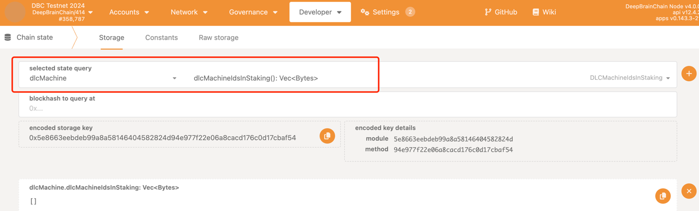
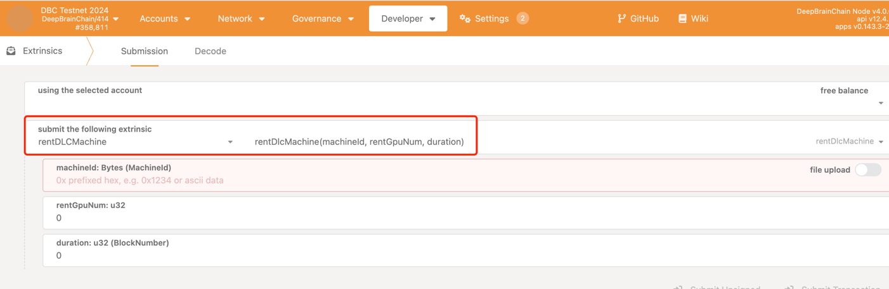
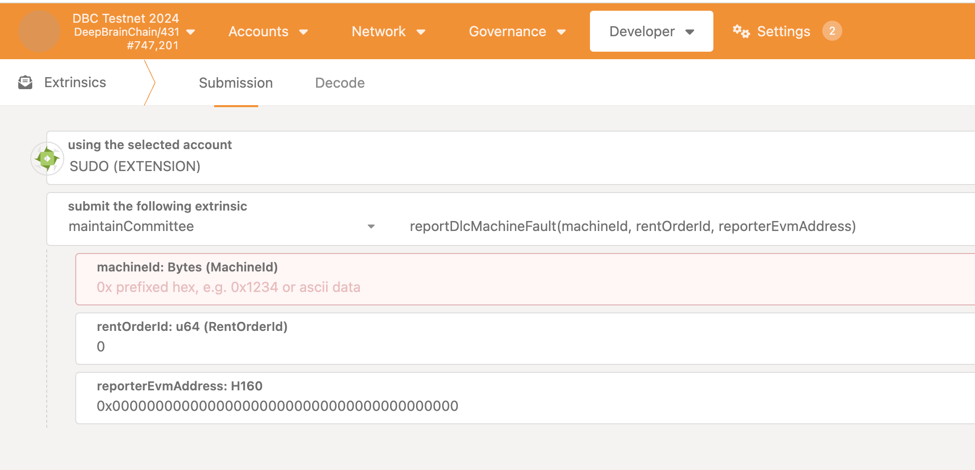

# directions for use

## directions for use of minter
testnet call function endpoint:
https://blockscout-testnet.dbcscan.io/address/0xc1d4f981a24fdf37e44291e5c9424496e1c7b8b2?tab=write_proxy

testnet staking contract address：0xc1d4f981a24fdf37e44291e5c9424496e1c7b8b2

testnet DLC token contract address：0xd6a0843e7c99357ca5bA3525A0dB92F8E5817c07

testnet NFT(DLC NODE) contract address：0x2d8c44616e04B7F131bEee1e9b878765356F56f9

### Staking
    1.bonding your machine in the DBC Mainnet/Testnet wallet : https://deepbrainchain.github.io/DBC-Wiki/en/onchain-guide/bonding-machine.html

    2. Rent your own machine in the DBC Mainnet/Testnet wallet : https://deepbrainchain.github.io/DBC-Wiki/en/onchain-guide/rent-machine.html
    
    3. Call stake(..) function in the DLC staking contract on DBC mainnet evm/testnet evm

### Claim reward
    1. Call claim(..) function in the DLC staking contract on DBC mainnet evm/testnet evm

### End staking
    1. Call unStakeAndClaim(..) function in the DLC staking contract on DBC mainnet evm/testnet evm

## ## directions for use of renter
### rent
    1. Check the id of the machine that can be rented in the dlcMachineIdsInStaking function of the dlcMachine module of the DBC Mainnet/Testnet wallet

    2. Rent a machine by calling the rentDlcMachine function of the rentDLCMachine module and fill in the relevant parameters

### report fault machine
    1. report by calling the reportDlcMachineFault function of the maintainCommittee module of the DBC mainnet/testnet wallet, fill in the relevant parameters, and two days after the report is approved, the evm wallet address provided by the reporter will be transferred to the report reward
